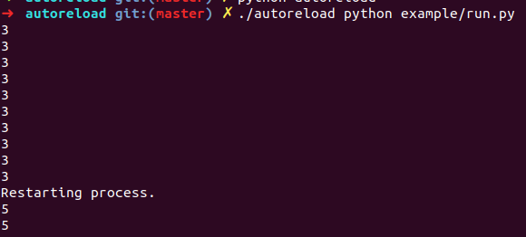

Autoreload is a simple python script to watch a directory for changed files
and restarts a process when the change is detected.

To use autoreload:

1. Make sure the script is executable by running `chmod +x autoreload`.
2. Put the script which needs reloaded under a directory, `example` for instance.
3. Run `./autoreload <command to run and reload>`,
run.py reads as below, print `3` every second.
```
#!/usr/bin/env python
#-*- encoding:utf8 -*-

import time


while 1:
    print(3)
    time.sleep(1)

```
For instance, I run `./autoreload python example/run.py`. This first runs
`python example/run.py`, then watches the current working directory and all
subdirectories for changes. If any changes are detected, I change `3` to `5`,  then the
process is killed, and started all over again.  
 

